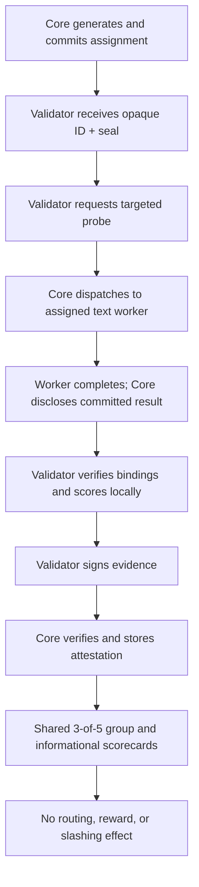

import { Callout } from 'nextra/components'

# Validator Nodes

<Callout type="info">
  **Status: public evidence-only preview.** Grid-issued text assignments,
  targeted probes, scorecards, and a non-economic quorum lifecycle are live in
  core. Validator rewards, staking, routing weight, and slashing remain
  disabled. [Download and run the verified preview](https://aipowergrid.io/validate).
</Callout>

Validators are being built as the Grid's independent audit layer. Today's
preview checks specific text job contracts and submits attributable signed
evidence. It does not prove a remote machine runs a particular model, establish
general answer quality, or grant workers more routing trust.

---

## At a Glance

| | |
|---|---|
| **Status** | Assignment-bound text evidence live; operator release still preview |
| **What validators do** | Run randomized, assignment-bound text probes and submit signed attestations |
| **Current authority** | Informational evidence for dashboards and engineering feedback |
| **Later authority** | Routing reputation, rewards, and objective-fraud slashing only after independent qualification, adversarial validation, and dispute safeguards |
| **Hardware** | CPU + bandwidth for V0; optional GPU for future reference/re-execution lanes |
| **Base role** | Future validator stake, epoch/reward roots, and dispute outcomes; no validator contract writes today |

---

## Validator Data Flow

The architecture is staged. Production Core issues a sealed text assignment:
the node sees its opaque ID, capability, and commitment before execution, then
verifies the disclosed worker, challenge, nonce, and result afterward. Core
hard-targets the worker and verifies submitted signatures and evidence binding
before aggregating non-economic quorum state. Missing assignments fail
closed; the public preview does not fall back to random production probes.
Current preview evidence does not move money, change routing, or slash stake;
media reference lanes and Base roots remain disabled.



Distinct registered nodes are not automatically independent operators. Sealing
limits advance disclosure; it does not make public templates unrecognizable to
workers. A script can pass simple echo checks, so these checks are not quality
proofs. Reference-worker comparisons, media issuance, blind quality audits, and
Base commitments are future lanes with separate rollout gates.

Raw prompts, raw outputs, challenge seeds, answer keys, and golden media hashes
stay off-chain. Any future Base integration should carry compact commitments
and reviewed economic state, not private workload content.

---

## Why It Needs a Separate Role

The original network treated workers as both the compute layer and the trust
layer. That works when workers compete on the same model and you can compare
outputs across them, but it breaks for:

- **Long-context generation** where outputs are non-deterministic
- **Image generation** where bit-exact comparison is meaningless
- **Specialized models** where only one or two workers are running them at any moment

A separate validator role lets the network measure delivered capability without
pretending every model label or quantization choice is directly provable. If a
worker can solve the text task, follow the image or video contract, and match a
certified deterministic workflow within tolerance, the network can reward that
usefulness. If it repeatedly fails objective checks, routing reputation should
drop first. Slashing is reserved for later, objective fraud cases with quorum
and a dispute path.

---

## Validation Lanes

Validators span text, image, and video, but each lane needs different evidence.

- **Proof of usefulness** — text reasoning, JSON/schema output, code tests,
  tool-use chains, image prompt constraints, and video duration or motion checks.
- **Proof of fidelity** — deterministic workflows with workflow hashes, model
  hashes, explicit seeds, dimensions, and pHash/SSIM/LPIPS-style comparison.
- **Proof of honesty** — max-token compliance, explicit seed compliance,
  dimension and duration compliance, usable outputs, signed receipts, and honest
  failure reporting.

For text, the Grid should care about measured capability more than whether a
worker runs a specific quantization. For deterministic media workflows, the
Grid can be stricter because fixed parameters and reference outputs make
fidelity measurable.

---

## Base Integration

The Grid uses Base for public, auditable economic state. Validator evidence
should not put every probe or raw response on-chain. The practical on-chain
surface is:

- validator registry and stake
- worker bond and future slash events
- epoch attestation roots
- deterministic workflow certificate roots
- validator reward roots

---

## What You'll Need

- **A dedicated signing identity**, created locally during setup; no funded
  wallet or personal private key is needed for the preview
- **A reliable host** with stable bandwidth
- **CPU resources** for V0 text canaries and signed evidence
- **Optional GPU resources** for future reference or re-execution lanes

Final stake size, reward schedule, and slashing conditions will be published
with the staking and reward contracts.

---

## Current Operator Preview

The evidence-only operator preview is live against production Core. The exact
unsigned release is
[`v0.1.0-preview.13`](https://github.com/AIPowerGrid/grid-validator/releases/tag/v0.1.0-preview.13).
Its installer, four platform archives, checksum manifest, SPDX SBOM, and build
provenance are published as one immutable payload. Linux x64/ARM64 users may
also pull `ghcr.io/aipowergrid/validator:v0.1.0-preview.13`; prereleases do not
publish `latest`.

The preview bundles the bounded image and video decoder dependencies on every
supported platform. This makes the public artifact media-capable, but Core
still issues no media assignments and media evidence has no economic effect.

Core `0029` contains the atomic budget and settlement terminal for future
compensated quality audits, but it is deployed dark. No audit scheduler,
private corpus, challenge selection, or quality scoring integration is live,
and current validator assignments remain unpaid and economically inert.

```bash
curl -fsSLO https://github.com/AIPowerGrid/grid-validator/releases/download/v0.1.0-preview.13/install-validator.sh
gh attestation verify install-validator.sh --repo AIPowerGrid/grid-validator
bash install-validator.sh
cd ~/.aipg-validator
aipg-validator self-test
aipg-validator enroll
aipg-validator check --no-probe
aipg-validator run
```

**Windows:** extract the Windows x64 ZIP, then double-click
`aipg-validator.exe`. Choose **8** to open the local operator app, then
**Set up node**, confirm, and **Start validator**. Existing operators skip
setup and keep their configuration. The preview is
unsigned; verify its checksum and GitHub provenance before running.

**macOS/Linux desktops:** `aipg-validator app` opens the same local controls.
The commands above remain the headless-server path. The app shows registration,
acknowledged heartbeats, assignment activity, accepted evidence, and redacted
diagnostics. Registration alone is not completed validation; waiting during
assignment cooldown is normal. Native offline packaging checks pass on all four
platforms, and the published Windows binary completed a first-party hosted live
runtime qualification. That proves the artifact runs; it does not count as an
independent operator or replace human desktop feedback.

**Stop** stops the process the app started, preserving its signing identity and
recovery journal. Closing only the browser tab leaves it running; **Exit app**
also closes the local server. Local stop does not revoke a key or suspend its
registration. Never share the private localhost URL or forward its port.

Automatic setup creates an empty local signing identity, authenticates a
dedicated node account with the Grid, and saves a validator-only API key. It
never asks you to paste a private key. Google and GitHub login are optional,
and no funds or stake are required. Back up the private configuration file;
do not post it or its contents in Discord or issues.

This does **not** pair the node with an existing Google or wallet account.
Authenticated existing-account pairing is separate work. Existing operators
should keep their current configuration when upgrading, not enroll a new
identity. A successful registration alone is not a validation result: confirm
a fresh heartbeat and accepted signed evidence after running.

### Linux server persistence

For the 72-hour cohort, use systemd instead of leaving a terminal or browser app
open. After the install, enrollment, self-test, and `check --no-probe` commands
above pass, download the service helper from its reviewed immutable commit and
verify its SHA-256 before running it:

```bash
cd ~/.aipg-validator
curl -fsSLo install-systemd.sh \
  https://raw.githubusercontent.com/AIPowerGrid/grid-validator/778e9a1f2263094918998954c62678dba6b90334/scripts/install-systemd.sh
printf '%s  %s\n' \
  32adb391ab0591a55b3cbefce851fb0b9965685dabfc26706d6458e488b5defd \
  install-systemd.sh | sha256sum -c -
chmod 700 install-systemd.sh
sudo AIPG_VALIDATOR_EXEC="$HOME/.local/bin/aipg-validator" \
  AIPG_VALIDATOR_WORKDIR="$HOME/.aipg-validator" \
  ./install-systemd.sh --dry-run
sudo AIPG_VALIDATOR_EXEC="$HOME/.local/bin/aipg-validator" \
  AIPG_VALIDATOR_WORKDIR="$HOME/.aipg-validator" \
  ./install-systemd.sh
sudo systemctl status aipg-validator --no-pager
sudo journalctl -u aipg-validator -f
```

The preview.13 executable and service helper are pinned independently. Do not
replace the helper URL with `master`, pipe it directly into a shell, or put a
private key/API key in a command. Stop any validator child started by the local
app before enabling systemd, and keep the same `.env` and validator ID throughout
qualification.

The preview is deliberately limited:

- V0 evidence is useful for dashboards and engineering feedback.
- V0 does not prove exact model weights.
- V0 does not slash workers or pay validators.
- Production Core enables targeted text probing only through a
  Grid-issued assignment. Arbitrary worker targeting is not supported.
- Three first-party nodes prove the protocol and deployment path, but they
  share one operator and hypervisor. Independent operation is not yet proven.
- Validator rewards, stake enforcement, routing influence, slashing, and media
  assignments remain disabled.

AI Power Grid currently needs two additional independently controlled Linux
operators to complete the first three-operator gate. The broader pilot still
targets 5-10 operators. Qualification runs for 72 hours with no reward, and one
person or organization counts once even if it runs several nodes. See the
[preview cohort runbook](https://github.com/AIPowerGrid/grid-validator/blob/master/PREVIEW_COHORT.md)
and [volunteer on the tracked cohort issue](https://github.com/AIPowerGrid/grid-validator/issues/5).

---

## Future Economic Path

The later validator economy is straightforward in shape, but it should not be
enabled until the evidence path is hard to game:

1. Grid issues short-lived assignments with a nonce and target worker.
2. Validators run the assigned probe and sign an evidence hash.
3. Grid aggregates attestations into scorecards and quorum outcomes.
4. Routing uses reputation cautiously before money is attached.
5. Accepted attestations could earn rewards after the economic and dispute gates ship.
6. Objective fraud may become slashable only after dispute tooling exists.

---

## Join the Preview

Start with the tracked cohort issue so enrollment and the independent-operator
gate remain visible:

**[Volunteer to run a validator](https://github.com/AIPowerGrid/grid-validator/issues/5)**

For community support, join the AIPG Discord:

**[discord.gg/W9D8j6HCtC](https://discord.gg/W9D8j6HCtC)**

If you want to dig into the broader network design, see
[Proof of Intelligence](/proof-of-quality), [Architecture Overview](/grid-overview),
and [Autonomous Network](/autonomous-network).
