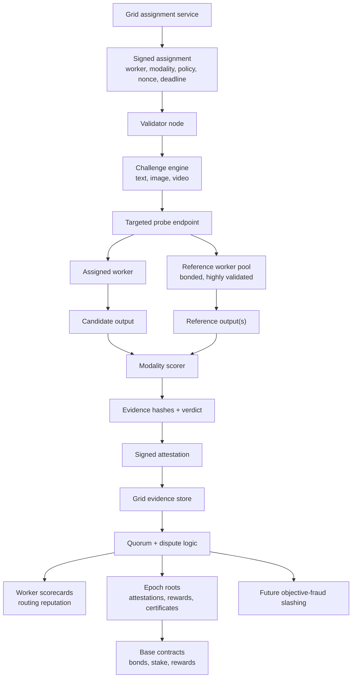

import { Callout } from 'nextra/components'

# Validator Nodes

<Callout type="info">
  **Status: in active development.** The first validator release is an
  evidence-only audit runner. Validator rewards, staking, routing weight, and
  slashing come later, after Grid-issued assignments, targeted probes, quorum,
  and dispute tooling are live.
</Callout>

Validators are the Grid's quality, honesty, and provenance layer. They do not
magically prove a remote machine is running a specific private model stack.
They measure whether workers deliver the capability they advertise, follow job
parameters, and deserve more trust.

---

## At a Glance

| | |
|---|---|
| **Status** | V0 preview in progress; evidence-only |
| **What validators do** | Run unpredictable probes and submit signed attestations |
| **Current authority** | Informational evidence for dashboards and engineering feedback |
| **Later authority** | Routing reputation, rewards, and objective-fraud slashing after quorum |
| **Hardware** | CPU + bandwidth for V0; optional GPU for future reference/re-execution lanes |
| **Base role** | Bonds, validator stake, epoch roots, reward roots, and dispute outcomes |

---

## Validator Data Flow

The target architecture is staged. V0 validators can run model-routed text
canaries and submit evidence, but that evidence does not move money or slash
stake. Economic meaning starts only after the Grid can assign a validator to
probe a specific worker and compare the result against quorum or trusted
reference output.



The important rule: raw prompts, raw outputs, private thresholds, live challenge
seeds, answer keys, and golden media hashes stay off-chain. Base gets compact
commitments, bonds, stake, rewards, and dispute outcomes.

---

## Why It Needs a Separate Role

The original network treated workers as both the compute layer and the trust
layer. That works when workers compete on the same model and you can compare
outputs across them, but it breaks for:

- **Long-context generation** where outputs are non-deterministic
- **Image generation** where bit-exact comparison is meaningless
- **Specialized models** where only one or two workers are running them at any moment

A separate validator role lets the network measure delivered capability without
pretending every model label or quantization choice is directly provable. If a
worker can solve the text task, follow the image or video contract, and match a
certified deterministic workflow within tolerance, the network can reward that
usefulness. If it repeatedly fails objective checks, routing reputation should
drop first. Slashing is reserved for later, objective fraud cases with quorum
and a dispute path.

---

## Validation Lanes

Validators span text, image, and video, but each lane needs different evidence.

- **Proof of usefulness** — text reasoning, JSON/schema output, code tests,
  tool-use chains, image prompt constraints, and video duration or motion checks.
- **Proof of fidelity** — deterministic workflows with workflow hashes, model
  hashes, explicit seeds, dimensions, and pHash/SSIM/LPIPS-style comparison.
- **Proof of honesty** — max-token compliance, explicit seed compliance,
  dimension and duration compliance, usable outputs, signed receipts, and honest
  failure reporting.

For text, the Grid should care about measured capability more than whether a
worker runs a specific quantization. For deterministic media workflows, the
Grid can be stricter because fixed parameters and reference outputs make
fidelity measurable.

---

## Base Integration

The Grid uses Base for public, auditable economic state. Validator evidence
should not put every probe or raw response on-chain. The practical on-chain
surface is:

- validator registry and stake
- worker bond and future slash events
- epoch attestation roots
- deterministic workflow certificate roots
- validator reward roots

---

## What You'll Need (When Live)

- **A Base mainnet wallet** to sign attestations and, later, hold validator stake
- **A reliable host** with stable bandwidth
- **CPU resources** for V0 text canaries and signed evidence
- **Optional GPU resources** for future reference or re-execution lanes

Final stake size, reward schedule, and slashing conditions will be published
with the staking and reward contracts.

---

## Current Operator Shape

The planned operator flow mirrors the worker quickstarts:

```bash
curl -fsSL https://get.aipowergrid.io/validator | bash
cd ~/.aipg-validator
aipg-validator init
aipg-validator check --no-probe
aipg-validator dashboard
aipg-validator run
```

The first release should be easy to run and honest about its power:

- V0 evidence is useful for dashboards and engineering feedback.
- V0 does not prove exact model weights.
- V0 does not slash workers or pay validators.
- V0 does not assign probes to a specific worker unless Grid core explicitly
  enables targeted probing.

---

## Future Economic Path

The later validator economy is straightforward in shape, but it should not be
enabled until the evidence path is hard to game:

1. Grid issues short-lived assignments with a nonce and target worker.
2. Validators run the assigned probe and sign an evidence hash.
3. Grid aggregates attestations into scorecards and quorum outcomes.
4. Routing uses reputation cautiously before money is attached.
5. Accepted attestations earn rewards.
6. Objective fraud may become slashable only after dispute tooling exists.

---

## Get Notified

The fastest way to hear about launch is the AIPG Discord:

**[discord.gg/W9D8j6HCtC](https://discord.gg/W9D8j6HCtC)**

If you want to dig into the broader network design, see
[Proof of Intelligence](/proof-of-quality), [Architecture Overview](/grid-overview),
and [Autonomous Network](/autonomous-network).
