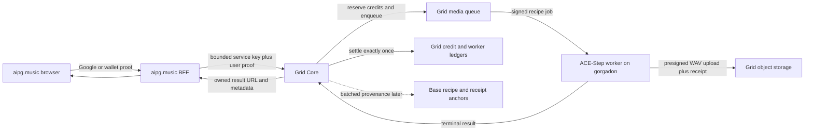

# aipg.music V1 proposal

## Decision

Build `aipg.music` as a separate consumer product. Do not place music creation
inside `aipg.art`, and do not fork the Gallery backend.

The first release should be a focused music studio powered by the Grid's
governed ACE-Step worker. It should prove that decentralized GPU supply can
deliver a polished consumer experience without exposing network mechanics in
the primary workflow.

## Product promise

Turn a musical idea and optional lyrics into a downloadable track using
community-operated compute.

The first screen is the studio, not a marketing landing page. A visitor can see
the creation controls immediately. Authentication is requested when the user
submits or opens private history.

## V1 scope

- Prompt-to-music with optional lyrics.
- Instrumental mode, represented by empty lyrics rather than a second backend
  contract.
- Duration control within Core's 10-300 second limit.
- Simple quality control mapped to Core's bounded inference-step range.
- Random seed by default; an advanced control can pin a seed for repeatability.
- Generation progress with honest queued, assigned, generating, uploading, and
  complete states where Core exposes them.
- Native audio player, waveform, elapsed time, and output metadata.
- Download the original WAV.
- Reuse settings, reroll with a new seed, or intentionally repeat the seed.
- Private recent-generation history tied to the canonical Grid account.
- Google and wallet sign-in, with both identities linkable to one Grid account.
- Core-owned credit balance and charging. The frontend never maintains a local
  free-generation counter.

## Explicitly out of V1

- A public music feed, likes, comments, follows, or creator rankings.
- Uploaded reference audio, voice cloning, or artist impersonation controls.
- Stem separation, mastering, a DAW timeline, or multitrack editing.
- NFTs or per-generation blockchain transactions.
- A frontend-maintained model catalog or pricing table.

These exclusions keep the first release useful while avoiding rights,
moderation, storage, and product-complexity commitments before the generation
rail is proven under real load.

## Information architecture

### Studio

The default route. A two-column desktop workspace and a single-column mobile
flow:

- Main composition area: prompt, lyrics/instrumental mode, duration, and
  generate command.
- Persistent output area: job progress followed by the player and waveform.
- Compact advanced drawer: seed and inference steps.
- Account control: identity, available credits, and private history.

### Library

Private generated tracks only. Rows are optimized for repeated listening and
reuse rather than decorative cards. Each row includes title or prompt excerpt,
duration, created time, seed, play, download, and reuse-settings actions.

### Track

A private permalink for one completed generation. It can expose provenance
metadata, recipe commitment, worker receipt status, and an eventual epoch
anchor without pretending that a hot-path blockchain transaction occurred.

## Visual direction

Keep the AI Power Grid identity while making the product feel musical rather
than cloning the website or art gallery:

- Near-black and graphite work surface.
- AIPG orange for primary commands and network provenance.
- A second cool accent, such as clean cyan, for playback position and waveform
  selection. Avoid an orange-only palette.
- Use the canonical worker logo as the compact product mark, paired with the
  literal `aipg.music` name in the first viewport.
- Use the brand's current sans-serif family for UI. Track titles and controls
  remain compact; no oversized marketing hero inside the studio.
- Waveform and cover treatment should be derived from the actual generated
  audio state, not decorative gradients or unrelated stock imagery.

## Architecture

Use a new Next.js application and a thin server-side BFF. Deploy it separately
from Gallery, initially on Vercel with `aipg.music` as the production domain.

The browser must never receive the Grid service key. The BFF exchanges a
verified application identity for a short-lived Core user token, then submits
the strict audio request. Core remains authoritative for account ownership,
credits, reservation/settlement, model availability, recipe selection, worker
routing, and output URLs.

## API contract

V1 should consume the existing governed endpoint:

`POST /v1/audio/generations`

The BFF accepts only the matching public subset:

- `prompt`
- `lyrics`
- `seconds`
- `inference_steps`
- optional `seed`

It must not accept a caller-selected worker or recipe root. Model selection can
be omitted while only one governed audio model is live. The BFF applies a hard
request deadline longer than Core's audio ceiling and aborts on client
disconnect without assuming that cancellation reverses a dispatched job.

For launch, a synchronous request is acceptable because Core already owns the
durable reservation and worker terminal. Before broad traffic, expose a proper
Core job resource or server-sent progress endpoint so a browser refresh does
not lose observation of a running generation.

## Accounts and credits

- Reuse canonical Grid accounts. Do not create an `aipg.music` balance.
- Google and wallet identities must resolve to the same linked account when the
  user proves both.
- Provision one service client named `aipg-music` with only the required user
  exchange and inference scopes.
- Give the service client conservative per-request and daily ceilings.
- Keep charging dark for the first supervised job. Enable it only after the
  reservation, success settlement, failure release, and stale-hold paths are
  observed on real Postgres and the live worker.
- Display Core's quoted or settled amount; never reproduce price math in the
  browser.

## Storage and privacy

- Lyrics and prompts are private by default.
- Do not put lyrics in client analytics, logs, error tracking breadcrumbs, or
  public metadata.
- Store only the minimum owned history needed for the Library.
- Use short-lived signed output URLs or an owner-checked download route.
- A public sharing feature requires a separate moderation and rights review.

## Blockchain use

Blockchain belongs in provenance and settlement auditability, not generation
latency:

- Register the canonical recipe commitment in RecipeVault for the eventual
  public profile.
- Include the recipe root and signed worker receipt in track metadata.
- Anchor batches of completed receipt roots by epoch once JobAnchor is ready.
- Link to Base only when an anchor actually exists.
- Do not mint by default and do not require a wallet transaction to generate,
  listen, or download.

## Rollout

### Stage 0: operator canary

- One signed, exact-digest pilot profile on the gorgadon RTX 3090.
- Core audio and worker enrollment enabled with demand charging still off.
- One authenticated end-to-end WAV request.
- Verify upload, receipt, demand reservation lifecycle, worker ledger row, and
  no duplicate payout on replay.

### Stage 1: private product alpha

- Studio, private Library, Google and wallet login, and credit display.
- Invite-only or account allowlist.
- Operational dashboards for queue age, generation latency, failures, storage,
  and GPU health.
- No public sharing.

### Stage 2: public beta

- Enable charging with an explicit price quote.
- Add durable job lookup and resumable progress.
- Publish support and content rules.
- Add another independently operated audio worker before marketing the service
  as decentralized supply rather than a Grid-routed single-worker preview.

## Launch gates

- A signed pilot profile is accepted only by exact Core digest.
- Worker identity and payout delegation verify on every registration.
- Core rejects audio while no approved worker is online.
- A job cannot dispatch without an atomic credit reservation when charging is
  live.
- Success settles demand and worker accounting exactly once.
- Failure releases the reservation exactly once.
- Output URL ownership is enforced.
- Service credentials are server-only and bounded.
- Prompts and lyrics are absent from public logs and analytics.
- Mobile and desktop browser checks cover submit, progress, playback, download,
  history, auth expiry, insufficient credits, worker loss, and timeout.

## Recommendation

Build the standalone product after Stage 0 proves the live rail. Reuse the
universal account and credit architecture, but start a clean `aipg-music`
repository rather than extracting Gallery's audio commit. The Gallery branch
was useful as a contract prototype; it should not become the production
frontend architecture.
